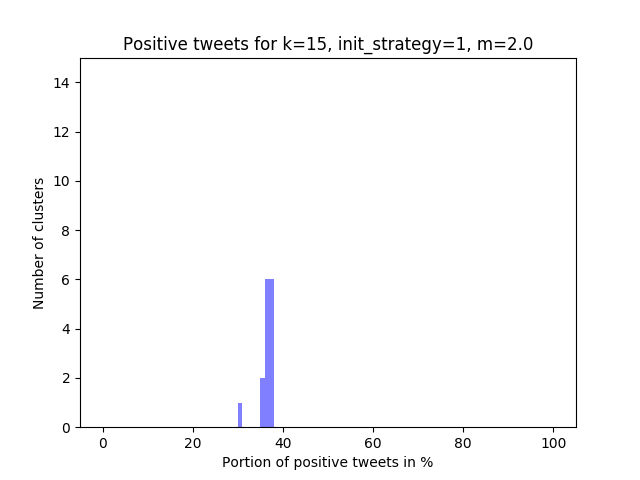
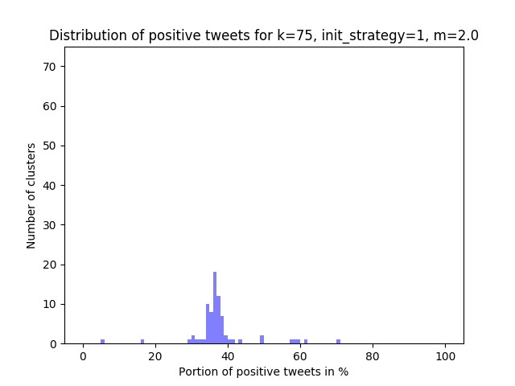

<!---
theme: gaia
class:
  - lead
  - invert
--->

# Document Clustering and Sentiment Analysis using Tweets

---

<!---
class:
--->

### Data Mining Project at the Universidad del País Vasco (Bilbao, Spain)

winter semester 2019/20 course *Minería de Datos* (Data Mining)

Group members:

* Marius Kempf, *Karlsruher Institut für Technologie*
* Simon Richebaecher, *Karlsruher Institut für Technologie*
* Daniel Helmrich, *Universität Leipzig*

---

### Task

* implementation of k-means algorithm without usage of any external libraries (like scikit-learn, ...)
* enhancement of the k-means with advanced techniques from an academical paper
* apply the k-means algorithm on a data set
* find the best clustering result by using different metrics, compare cluster purity of external labels
* graphical representation of the results
* final report

---

### Data set: Sentiment140 

https://www.kaggle.com/kazanova/sentiment140

* contains 1.6 million Twitter tweets 
* sentiment label for each tweet (negative and positive) <!-- automatically generated using neural network, neutral sentiment: theoretically yes, but never appears-->
* other fields: date, id, query, Twitter user

Example:

```csv
"0","1467811372","Mon Apr 06 22:20:00 PDT 2009","NO_QUERY","joy_wolf","@Kwesidei not the whole crew "
"0","1467811592","Mon Apr 06 22:20:03 PDT 2009","NO_QUERY","mybirch","Need a hug "
```

---


### Project Realization: Main question

**Based on their content, can the tweets be grouped in such a way that the clusters reflect the sentiments?**

What is the best clusterization to achieve this goal, i.e. 

* what pre-processing must be done?
* which model should represent the tweets inside the k-means algorithm (tf-idf, ...)
* what parameters of k-means achieve the best results (number of clusters, initialization strategy, distance metric, ...)

---

<!--class:-->

### Project Realization: Keypoints

* Pre-Processing of the tweets and train doc2vec model
* Implementation of the k-means algorithm
    * many configurable parameters (initialization strategy, distance metric, number of iterations, ...)
    * accelerated approach described by Hamerly, G. (2010)
* Run the clustering process many times with different parameters (~3 weeks, Google Cloud)
* Evaluation of the clustering results considering the sentiment label
* Generate wordclouds from the clusters; html presentation

---

### Implementation Details

* code on github: https://github.com/dhelmr/data-mining-upv
* realized in python
* each step consists of an own python program
 $\implies$ flexibility, customization through CLI parameter
  * Pre-processing and doc2vec model: `data_splitting.py`, `data_cleaner.py`,`d2v_trainer.py`,`d2v_apply.py`
  * K-means clustering: `run_clustering.py`
  * Evaluation: `run_evaluation.py`, `run_centroids.py`
  * Graphical presentation: `cluster_to_tweets.py`, `word_cloud.py`, `make-html.py`


---

### Data preparation: Splitting


---

### Pre-Processing

* Lower-casing the tweet
* Removal of user names
* Removal of website links
* Expanding contractions
* Word Stemming
* Common English Stopwords Removal

---

### Training of the Doc2Vec Model

* Usage of one half of the data set (~800.000 tweets)
* In theory, other data sets could be used for training the doc2vec model (Wikipedia, ...)
* vector size: 200, window size: 5, negative size: 5, training epoch: 10, 30, 600

Hyper-parameter combination based on the work of Lau & Baldwin (2016): Analysis of questions and answers from Stackexchange forums

---

### K-means implementation: Basic features

* variable number of clusters k
* allows to specify the maximum number of iterations
* allows to specify threshold for the change after each iteration; if the change is smaller than the threshold, the algorithm terminates

--- 

### K-means implementation: Basic features

##### Distance metric: Minkowski distance

* generalization of Euclidean and Manhattan distance
* depends on the parameter m:

$$ d(X,Y) = \sqrt[m]{\sum_{i=1}^{n}|x_i-y_i|^m} $$

* special cases: m=1 (Manhattan), m=2 (Euclidean)

<!-- For doc2vec, a metric based on the cosine similarity is also interesting, but it was required to implement the minkowski distance for our algorithm. 
We also implemented skip checks that exploit the triangle inequality and this is not possible with cosine similarity
-->

---

### K-means implementation: Basic features

##### Initialization strategies

1. Choose k random instances and use their coordinates as the initial centroids
2. *Double-k*: 
    1. first run the k-means algorithm with the same parameters, but with 2k clusters that are randomly initialized
    2. Choose the k best clusters and use their centroids for the initialization 
    (*"best"* = clusters with the lowest mean squared distances between their centroids and instances)

---

### K-means implementation: Basic features

##### Run k-means multiple times

* offers the possibility to run the algorithm multiple times and choose the best clustering result afterwards
(*"best"* = results with the lowest squared summed error)
* useful to avoid bad results due to a poor random initialization

---

### K-means implementation: Acceleration by Hamerly

Described in: *Hamerly, G. (2010), ‘Making k-means even faster.’, Proceedings of the 2010 SIAM International Conference
on Data Mining pp. 130–140.*

* idea: keep track if an instance must still belong to the same cluster 
* introduces quick checks in each iteration for skipping the innermost loop of the algorithm (time-intensive calculation of the nearest centroid)

---

### K-means implementation: Acceleration by Hamerly

##### Additional data structures

* for each centroid the distance by which it was moved lastly (if > 0)
* for each centroid the distance to the closest other centroid
* for each instance an upper bound on the distance to the assigned centroid
* for each instance a lower bound to the second closest centroid

The bounds are updated in each iteration of the algorithm

---

##### Skip case I: The upper bound to the closest center (green) is smaller than the lower bound (red) to the second closest center

* A: instance, C1 and C2: centroids
* $l_A$: lower bound to the second nearest cluster, $r=g-P_{C2}$
* $u_A$: upper bound to the nearest cluster, $r=h+P_{C1}$

 


<!--
An example can be seen in Figure 4. Supposing that the bounds were be initialized with l(A) = g
and u(A) = h, the closest centroid C1 was moved away from the data point A, but the second
closest centroid C2 moved in direction of A. After these changes, the upper and lower bounds are
recalculated respectively: The upper bound on the distance to the closest center (C1) is increased
with u(A) := u(A) + PC1, whereas the lower bound to C2 gets reduced with l(A) := l(A) − PC2.
As the red circle indicates, the distance from A to C1 is still lower than from A to C2.

-->

---

##### Skip case 2: $u_A$ is lower than the distance $s_C$ from a centroid to the closest other centroid, divided by 2

 

<!--
In that case, it is safe to say that A is within the circle shown in figure 5. As s1 is the smallest
distance from C1 to any other centroid, the closest centroid from A must be C1 .
--->

* $C1, C2, C3$: cluster centroids
* $A$: Instance 
* $u_A < 0.5 \times s_C$ ($A$ lies within the black circle)
$\implies$ the nearest centroid from A must be $C1$

--- 

##### Further optimization

usage of numba: https://numba.pydata.org/

* Just-In-Time compilation for often-used parts of the algorithm (distance calculation, ...)
* brought significant speed boost

##### Testing concept: Test against scikit-learn

* Randomly initialize a set of high dimensional data 
* compare the clustering results of both implementations after 1000 iterations

---

##### Clustering process

* Used doc2vec representation of ~300.000 tweets for clustering
* Realized with the cloud computing service Google Cloud (4 CPUs with 2.2 Ghz per core)
* parameter variation:
  * epoch: 10,30 and 600
  * minkowski parameter: m=1, m=2, m=15
  * Initialization strategy: random or double-k
  * number of cluster: k=2..15, k=20, k=50, k=75, k=100
* duration: ~3 weeks

--- 

### Evaluation: Hopkins statistic

* gives information about the general cluster tendency of the data

$hopkins \leq 0.5 \implies$ uniform distribution
$hopkins = 1 \implies$ compartmentalized and spatially separated data

* 600 epoch doc2vec data: hopkins score of 0.75

---

### Evaluation: Class vs cluster

* Examine the clusters on the sentiment label: How "pure" are the clusters?
* Average of purity is almost always aroung 63%
* very low variance, a bit higher for high k (>50)
* data split that was used for clustering: 63.21% negative; 36.79&% positive tweets
* clusters contain the sentiment labels almost exactly randomly distributed

**Conclusion**: Almost no correlation between clusters and sentiment visible for low k

---


---





---





--- 


---

### High k yields more pure clusters:

##### Cluster 41 (k=75, m=2)
* number of tweets: 970
* positive tweets: 5.67%


---

##### Cluster 47 (k=75, m=2)
* number of tweets: 840
* positive tweets: 70.95%


---

### Introduce new instances to a clustering result

Use new instances from the test split and output instances from the nearest cluster 

##### Example for m=1; k=100

New tweet: ```@Alyssa_Milano Sad that people have the expectation for you to respond. You shouldn't have to explain cause the majority understand```

---

Result: 

```txt
ORIGINAL:   Im sad now  I should be on my way to NC rite now
CLEANED:    sad way nc rite
ORIGINAL:   its sad have so many disapoitmants in one day  wolverin's movie its sucks 
CLEANED:    sad mani disapoitm one day wolverin movi suck
ORIGINAL:   Is so sad after watchin Jon &amp; Kate plus 8  . For the record tho, ya , Kate's a bitch, but Jon is a selfish asshole.
CLEANED:    sad watchin jon amp kate plu record tho ya kate bitch jon selfish asshol
ORIGINAL:   Sad, sad, sad. I don't know why but I hate this feeling  I wanna sleep and I still can't!
CLEANED:    sad sad sad know hate feel want sleep still
ORIGINAL:   its sad have so many disapoitments in one day  wolverin's movie its sucks 
CLEANED:    sad mani disapoit one day wolverin movi suck
ORIGINAL:   is sad coz hyd theka's dont have beer 
CLEANED:    sad coz hyd theka beer
ORIGINAL:   @2012ad that is so sad  Suicide is hard enough to deal with even when you hardly know the person or any of their connections
CLEANED:    sad suicid hard enough deal even hardli know person connect
ORIGINAL:   @felixthecat12b that makes me sad. just like how aag kicking over a mex. fruit stand makes me sad.  is she ok? what happened to her ride?
CLEANED:    make sad like aag kick mex fruit stand make sad ok happen ride
ORIGINAL:   @x_himynameisale I don't know... I'm sad 
CLEANED:    know sad
ORIGINAL:   Its a very sad day  my cat has going missing and my dog is very sick.. Miss u Oscar please come home Aussie get better !!
CLEANED:    sad day cat go miss dog sick miss u oscar pleas come home aussi get better
```

---

### Result Discussion: Possible reasons for unsatisfactory results

* Doc2Vec does not necessarily contain information about sentiments, rather about topics
* Much higher k might be needed (200, 500, ...)
* Sentiment label is not necessarily valid (generated automatically)
* binary labeling might be insufficient: "neutral" label is never used
* limited project scope; only a few parameter variations could be tested
* K-means might not be the right algorithm for a good clusterization

---

### Possible Further Steps

* Try to achieve better results with higher number of clusters k
* Use cosine similarity as a distance measure
* Examine the clustering results based on internal evaluation
* Try to gain new information from the clusters, disregarding the sentiment label (e.g. cluster topics, unique words)
* Find a useful application for introducing new tweet-like texts to a clustering result (topic detection, ...)